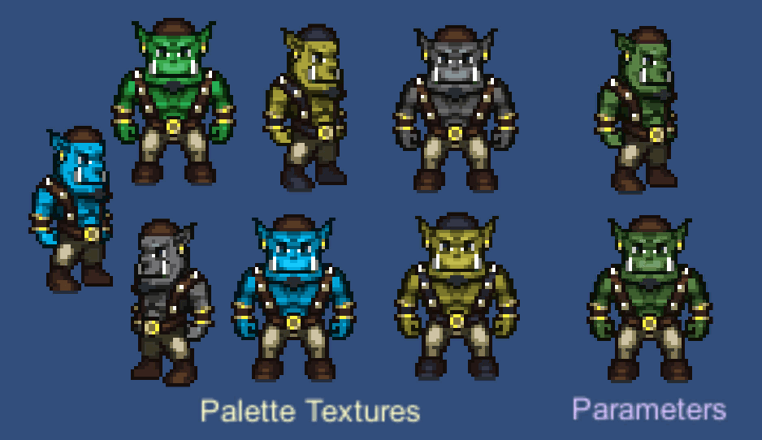

# Sprite Recolour Map Generator

## Introduction

This tool generates the base textures needed to easily recolour 
sprites flexibly on the fly in a shader, while preserving easy authoring of the 
original sprites.

There's a demo project in Unity using assets produced by this tool here:
[Unity Sprite Recolouring Demo](https://github.com/sinbad/SpriteRecolourUnity).


## How to use

An artist creates a sprite exactly as they usually would. This tool generates
from that a derived "reference" sprite and a base palette, stored either as a
separate small texture or shader parameters. Combining the two in a shader
re-creates the original appearance, and alternative colour palettes can swapped 
in at runtime by providing alternate palette textures or changing shader 
parameters.

```
Usage:
  spriterecolour [options] <input file>

Options:
  -o, --output string    Output sprite file; default <input>_reference.png
  -t, --texture string   File to write palette as texture; default <input>_palette.png
  -p, --params string    File to write shader params to; default none
                         Mutually exclusive with --texture
  -b, --byte-params      When using --params, write values as 0-255 instead of 0.0-1.0-255
```

## Principle

### Previous work

The core idea is an extension of [this blog post](https://gamedevelopment.tutsplus.com/tutorials/how-to-use-a-shader-to-dynamically-swap-a-sprites-colors--cms-25129). In that
case, the Red colour component of the original sprite is used to index a 
texture containing the replacement colours. While this is fine, it requires that
the artist never uses 2 colours with the same Red value, which is overly 
limiting.

### What SpriteRecolour does differently

SpriteRecolour allows the use of any input sprite, and performs these steps

1. Analyse the image and identify all the unique colours
2. Sort the colours into a colour palette ordered by perceptual distance (CIE76)
3. This palette is saved to a palette texture; this is power-of-two sized, and
   at most 256 wide. If more than 256 colours are needed the texture also grows
   vertically in powers of 2.
4. Write another sprite texture the same size as the original, which we call the
   **reference sprite**. Set the colour components as follows:
   * R = Colour index, which is either:
     * U texture coord to palette texture (default if --params not used)
     * Parameter index to shader parameter (if --params used)
   * G = V index of colour in palette texture (if --params not used)
   * B = Currently unused
   * A = original alpha

When rendering the sprite, we simply combine the **reference sprite** with 
*either* a modified palette texture or modified shader arguments to recolour it. 

The recombination algorithm is:

```
out.rgb = GetPaletteColour(in.r, in.g);
out.a = in.a;
```

Where `GetPaletteColour` either samples a palette texture (no filtering /
mipmapping) or indexes an array of shader constants containing the replacement
colour.

### Differences when using palette textures/parameters
The values in the Red channel are different depending on whether you're using
a palette texture or shader parameters to specify the palette. 

1. When using a **palette texture**, the colour index is rescaled so that it
   becomes a valid texture coordinate. If the palette texture is smaller than
   256 pixels wide then this will be different to the colour index. The same
   applies to the green channel if more than 256 colours are used.
2. When using **shader parameters**, the values are always the unmodified index
   of the colour. Because of this a maximum of 256 colours are allowed

## Limitations

### No filtering or mipmaps

Mipmapping or filtering doesn't work because the textures are no longer continuous,
having unrelated values next to each other. Therefore you need to disable all
texture filtering and mipmaps for both the reference sprite and the palette
texture.

### No lossy compression

Because the output reference sprite relies very heavily on correct indexing 
using the Red channel, lossy compression cannot be supported. The reference
sprite is always output in PNG format right now, and you should not convert it
to a lossy compressed format such as JPG or (sadly) ETC/DXT/S3TC. 

#### Example: texture settings in Unity
Click on the sprite texture, and in the Inspector, check the "Override for.."
box and set the format to "Truecolor" (or in Advanced mode, "ARGB 32 bit"). 

You probably also want to make sure that the Packing Tag for the sprite is set
to a value that is only shared by other sprites using recolouring.

Note: if you're using a texture as the recolour palette, make sure you import
this into Unity as a regular texture and that it's not a Sprite, you don't want
to pack it with other sprites. You can use compression for this texture if you
like but watch out for artefacts if adjacent hues are very different.

### L8A8 support

Where the number of colours in the input sprite is <= 256, we could encode it in
the reference sprite as just 8 bits of luminance and the alpha, i.e. L8A8 rather
than RGBA. The only reason I'm not doing this is that I found out too late that
Go's image package doesn't support LA formats, only RGB[A] and plain L 
(greyscale).

You can work around this by post-processing using ImageMagick:

```
convert -separate -channel RA -combine sprite_reference.png sprite_reference_la.png
```

The output `sprite_reference_la.png` only uses 2 channels then, which in 
uncompressed texture memory is half the size (the PNG will only be a bit smaller
because of its compression but at runtime it will be uncompressed). It's only 
worth doing this if the engine you're using supports L8A8 textures;  for example
as far as I could tell Unity still converts L8A8 PNGs to RGBA textures 
internally, so you don't save anything in practice. Other engines may support
L8A8 natively (e.g. I know [Ogre](http://ogre3d.org) does)

### Premultiplied alpha

Premultiplied alpha is not supported right now, because the palette RGB and
alpha are stored separately. If you use an input texture with premultiplied
alpha then things may kind of work; but if alpha varies per reference colour
you'll get more colours in the output palette (since say red=200 is 200 at full
alpha and 100 at half-alpha, which looks like different colours to this tool)
so it won't be as easy to supply replacement palettes.